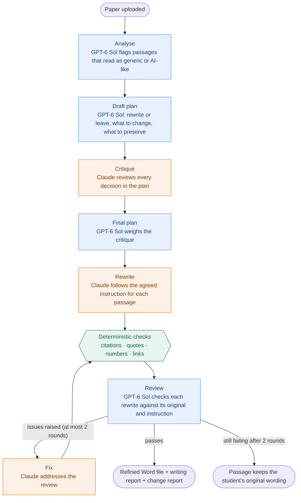
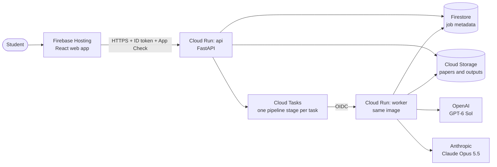

<div align="center">


# PaperAid

**Paper-ready academic work: clearer writing, correct formatting, and every change reviewable.**

[](https://github.com/Isaac25-lgtm/PAPER-AID/actions/workflows/ci.yml)      

[How it works](#how-it-works) · [Services](#services) · [Getting started](#getting-started) · [Architecture](#architecture) · [Roadmap](#roadmap)

</div>

---

## Overview

PaperAid is a **job-based** service for students, not a chatbot. A student uploads a paper, chooses a service, sees a price calculated by the server, and later downloads a finished Word document with a report of exactly what changed.

It is built around three promises:

- **Your meaning stays yours.** Citations, quotations, numbers, links and footnotes are locked before any model sees the text, and every rewrite is checked against them afterwards.
- **Nothing is hidden.** Every refined passage comes with the reason it was changed. Anything PaperAid could not do safely is reported, and the job is marked as a partial result rather than presented as a clean success.
- **Nothing is simulated.** If a service can't really run (for example, AI keys are not configured), it is shown as unavailable. PaperAid never produces placeholder results.

> PaperAid helps students make their own work clearer and correctly formatted. It is not a tool for disguising AI-generated text or evading AI detectors, and students confirm the work is their own before every job.

## Services

| Service | What it does | Needs AI | Status |
|---|---|:---:|---|
| **AI Check** | Passage-by-passage writing-pattern report with an *Estimated AI-likeness* band (Low / Moderate / High) and a confidence level. The document is not edited. | ✓ | Available once AI keys are set |
| **Check + Refine** | Rewrites flagged passages under an agreed plan, with citations and numbers locked and each change independently reviewed. | ✓ | Available once AI keys are set |
| **Academic formatting** | APA 7 or Harvard layout: margins, fonts, spacing, headings, page numbers and preliminary pages. Wording is verified unchanged. | — | Available |
| **University templates** | Reads the department's own formatting guide, shows the sentence each rule came from, and applies the rules. Contradictions and rules it can't apply are reported. | ✓ | Available once AI keys are set |
| **Deep redraft** | Section-by-section restructuring of the student's own draft. | ✓ | Coming soon |
| **LaTeX conversion** | Word to LaTeX. | — | Coming soon |

Word (`.docx`) works with every service. Text-based PDFs work with AI Check.

## How it works

Every AI service runs the same fixed two-model algorithm. **GPT-6 Sol** is the *lead*: it analyses, plans and reviews. **Claude Opus 5.5** is the *writer*: it critiques the plan, writes, and fixes what the lead raises.



**University templates use the same loop over formatting rules:** GPT-6 Sol drafts rules from the guide (quoting where each came from), Claude critiques, GPT-6 Sol finalises, PaperAid's formatter applies them (it cannot change a word, and this is verified), GPT-6 Sol reviews the result, and Claude corrects the rules, for at most two rounds.

### Safeguards

- **Locked content.** Citations, quotations, URLs, numbers and footnote references are masked before a model sees the text. Each must reappear exactly once, and no new citation may be introduced.
- **Wording fingerprint.** Formatting-only jobs verify that the body text is identical before and after.
- **Evidence you can check.** Template rules are shown with the sentence from the guide they came from; quotes that can't be found in the guide are flagged.
- **Honest outcomes.** Passages the writer didn't return, rules that couldn't be applied, and analysis that didn't cover the whole paper are all reported, and the job is marked `PARTIAL`.
- **Cost control.** Every model call is costed as it happens, checked against the job's budget before it is made, and cached so a retry never pays twice.

## Getting started

### Prerequisites

- **Python 3.12+** and **Node.js 20+**
- An **OpenAI** API key (GPT-6 Sol) and an **Anthropic** API key (Claude Opus 5.5) for the AI services

### Quick start (Windows)

Double-click **`start-paperaid.bat`**. The first run installs everything (a few minutes), starts the backend on port 8000 and the web app on port 5000, and opens **http://localhost:5000**. Close the two windows to stop.

### Manual start

```bash
# Backend (API and worker) on :8000
cd backend
python -m venv .venv
.venv/Scripts/pip install -e ".[dev]"
cp .env.example .env            # then add your keys (see below)
.venv/Scripts/python -m uvicorn app.main:app --port 8000

# Web app on :5000 (in a second terminal)
cd web
npm install
npm run dev
```

### Configuration

Settings live in `backend/.env` (copied from [`backend/.env.example`](backend/.env.example)). Never commit this file; in production, secrets live in Google Secret Manager.

| Variable | Purpose |
|---|---|
| `OPENAI_API_KEY` | GPT-6 Sol, the lead model. Required for AI services. |
| `ANTHROPIC_API_KEY` | Claude Opus 5.5, the writer model. Required for AI services. |
| `LEAD_MODEL` / `WRITER_MODEL` | Model references (`provider:model-id`). Defaults: `openai:gpt-6-sol`, `anthropic:claude-opus-5-5`. |
| `ADMIN_EMAILS` | Emails that get the admin console with the local test sign-in. |
| `MAX_WORDS`, `RETENTION_DAYS`, `MAX_ACTIVE_JOBS_PER_USER` | Product limits. |

Without **both** keys, AI Check, Check + Refine and University templates show as *Not set up* and cannot be quoted or run. Set a monthly spending limit in each provider's console before adding keys.

The web app needs no configuration locally. To use Firebase Authentication, fill in the `VITE_FIREBASE_*` values in [`web/.env.example`](web/.env.example). These are public by design; never put provider or payment keys in a `VITE_` variable.

### Signing in locally

Until a Firebase project is connected, the sign-in page offers a clearly labelled **local test sign-in** that works only on your computer: any email with an 8+ character password. Emails listed in `ADMIN_EMAILS` open the admin console at `/admin`, which shows every job with its timeline, model costs and failures, plus retry, cancel and a pause switch for all processing.

### Credits

Every job is paid from prepaid credits: a UGX balance, priced at the job's actual AI cost × 2 and never more than its quote. Until mobile-money top-ups are connected, an admin adds credits at **`/admin/credits`** (the student must have signed in once). Locally these are marked as test credits. See "Prepaid credits" in [`docs/decisions.md`](docs/decisions.md) for the full rules.

## Architecture



- **One backend, two services.** The same FastAPI image runs as a public `api` and an internal `worker`. Background work runs through Cloud Tasks, one pipeline stage per task, with leases, checkpoints and retries.
- **Region** `europe-west1`. Papers live in Cloud Storage; Firestore holds metadata only.
- **Locally**, the same code runs with a JSON job store, a local file store and an in-process queue, so no cloud account is needed to develop.

| Layer | Technology |
|---|---|
| Web | React 19, TypeScript, Vite, React Router, Tailwind CSS v4, Radix UI |
| Backend | Python 3.12, FastAPI, Pydantic v2, python-docx, lxml, pypdf |
| AI | OpenAI Responses API (GPT-6 Sol), Anthropic Messages API (Claude Opus 5.5), strict JSON-schema outputs |
| Platform | Firebase Auth, Hosting and App Check; Cloud Run; Cloud Tasks; Firestore; Cloud Storage; Secret Manager |

### Repository layout

```
backend/
  app/
    api/            HTTP routes (thin)
    jobs/           business rules, the job state machine, and the worker pipeline
    ai/             provider adapters, prompts, cost tracking, and the two-model orchestration
    documents/      upload validation, DOCX/PDF reading, locked segments, selective patching
    analysis/       writing-pattern signals and the Estimated AI-likeness band
    formatting/     APA/Harvard presets, guide-derived rules, and the formatter
    reports/        Word writing and change reports
    integrations/   local vs Firestore / Cloud Storage / Cloud Tasks implementations
  tests/            unit, API and pipeline tests; generator for 28 synthetic test documents
web/
  src/features/     marketing, auth, upload, jobs, results, account, admin
  src/lib/          the single API data layer, types and service copy
  scripts/          end-to-end browser journey and screenshot scripts
docs/
  decisions.md      owner decisions that refine the product specification
  deployment.md     step-by-step Google Cloud and Firebase setup
```

## Testing

```bash
# Backend: unit, API and pipeline tests, plus lint
cd backend
.venv/Scripts/python -m pytest -q
.venv/Scripts/python -m ruff check app tests

# Web: unit tests, then typecheck and production build
cd web
npm test
npm run build

# Full browser journey: start the browser-test backend, then run the journey
cd backend && .venv/Scripts/python -m tests.serve_e2e
cd web && node scripts/e2e.mjs out
```

The automated tests never call a paid provider: scripted stand-ins for both models live only in `backend/tests/`, and the app cannot import them. The browser-test backend uses its own data folder. GitHub Actions runs the backend and web checks on every push.

## Roadmap

- [x] Two-model algorithm for refinement and University templates
- [x] Locked citations and numbers, wording fingerprint, honest partial results
- [x] Admin console with costs, retries and a pause switch
- [x] **Prepaid credits:** a UGX balance (dollar equivalent shown); each job is priced from its actual AI cost × 2, held on acceptance and settled on completion; refinement is sized by a paid AI estimate first
- [ ] Mobile-money payments through an aggregator
- [ ] Firebase sign-in (Google and email) and production deployment
- [ ] Deep redraft and LaTeX conversion

## Documentation

- [`docs/decisions.md`](docs/decisions.md): the owner's product decisions, including the permanent algorithm and the no-placeholders rule
- [`docs/deployment.md`](docs/deployment.md): production setup on Google Cloud and Firebase
- [`CLAUDE.md`](CLAUDE.md): working rules for coding agents contributing to this repository

## Security

API keys belong only in `backend/.env` locally and in Secret Manager in production. They are never sent to the browser. Paper text, prompts, secrets and signed URLs are never logged. Please report security issues privately to the repository owner rather than in a public issue.

## License

No license has been granted yet. Until one is added, all rights are reserved by the owner, and the code may not be used, copied or distributed without permission.
